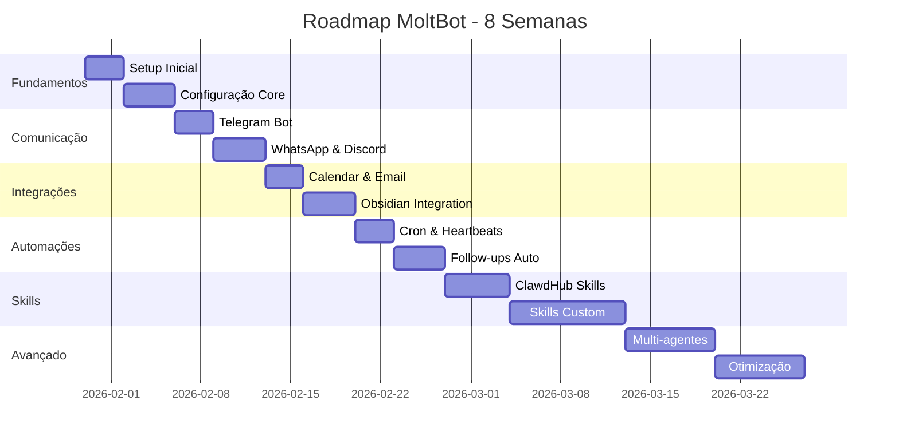

# 🚀 MOLTBOT - ROADMAP COMPLETO
        
> **Gerado em:** 30/01/2026 23:32  
> **Duração Total:** 8 semanas  
> **Objetivo:** Implementação completa do MoltBot Enterprise

---

## 📊 VISÃO GERAL



---

## 🎯 OBJETIVO POR SEMANA

### Semana 1: FUNDAMENTOS & CONFIGURAÇÃO CORE

**Duração:** 7 dias

#### Sprint 1.1 - Setup Inicial (3 dias)

**📋 Tarefas:**
- [ ] Instalar Node.js e npm
- [ ] Clonar repositório do Moltbot
- [ ] Instalar dependências (npm install)
- [ ] Verificar pré-requisitos do sistema
- [ ] Criar estrutura de pastas

**✅ Entregáveis:**
- Moltbot instalado e funcionando
- Primeiro teste de execução bem-sucedido

**💻 Comandos:**
```bash
git clone https://github.com/user/moltbot
cd moltbot
npm install
npm start
```

---

#### Sprint 1.2 - Configuração Core (4 dias)

**📋 Tarefas:**
- [ ] Criar arquivo moltbot.json
- [ ] Configurar chaves de API (Claude/OpenAI)
- [ ] Definir personalidade do bot
- [ ] Configurar arquivos de sistema
- [ ] Testar comunicação básica

**✅ Entregáveis:**
- moltbot.json configurado
- Bot respondendo comandos básicos

**📁 Arquivos a criar:**
- `moltbot.json`
- `personality.md`
- `system-prompt.md`

---

### Semana 2: CANAIS DE COMUNICAÇÃO

**Duração:** 7 dias

#### Sprint 2.1 - Telegram Bot (3 dias)

**📋 Tarefas:**
- [ ] Criar bot no BotFather
- [ ] Obter token de API
- [ ] Configurar webhook/polling
- [ ] Testar envio e recebimento
- [ ] Configurar comandos básicos

**✅ Entregáveis:**
- Bot Telegram funcionando
- Responde mensagens em tempo real

**🔧 Skills necessárias:**
- `telegram-bot`

---

#### Sprint 2.2 - WhatsApp & Discord (4 dias)

**📋 Tarefas:**
- [ ] Configurar WhatsApp Web API
- [ ] Criar bot Discord
- [ ] Configurar webhooks
- [ ] Testar multi-canal
- [ ] Sincronizar conversas

**✅ Entregáveis:**
- WhatsApp integrado
- Discord bot ativo
- Multi-canal funcionando

**🔧 Skills necessárias:**
- `whatsapp-bot`
- `discord-bot`

---

### Semana 3: INTEGRAÇÕES ESSENCIAIS

**Duração:** 7 dias

#### Sprint 3.1 - Google Calendar & Email (3 dias)

**📋 Tarefas:**
- [ ] Configurar OAuth Google
- [ ] Integrar Google Calendar API
- [ ] Configurar Gmail API
- [ ] Criar comandos de agendamento
- [ ] Testar criação de eventos

**✅ Entregáveis:**
- Bot cria eventos no Calendar
- Envia emails automaticamente

**🔧 Skills necessárias:**
- `google-calendar`
- `gmail`

---

#### Sprint 3.2 - Obsidian Integration (4 dias)

**📋 Tarefas:**
- [ ] Instalar obsidian-cli
- [ ] Configurar vaults
- [ ] Criar skill de criação de notas
- [ ] Implementar templates
- [ ] Testar workflows PKM

**✅ Entregáveis:**
- Bot cria notas no Obsidian
- Templates funcionando
- Vault-Analyst operacional

**🔧 Skills necessárias:**
- `obsidian-cli`
- `vault-analyst`

---

### Semana 4: AUTOMAÇÕES INTELIGENTES

**Duração:** 7 dias

#### Sprint 4.1 - Cron Jobs & Heartbeats (3 dias)

**📋 Tarefas:**
- [ ] Configurar cron jobs
- [ ] Criar heartbeats automáticos
- [ ] Implementar briefings matinais
- [ ] Configurar alertas
- [ ] Testar agendamentos

**✅ Entregáveis:**
- Briefings automáticos funcionando
- Alertas configurados
- Sistema de heartbeats ativo

**📁 Arquivos a criar:**
- `cron-jobs.json`
- `heartbeats.json`

---

#### Sprint 4.2 - Follow-ups Automáticos (4 dias)

**📋 Tarefas:**
- [ ] Criar sistema de follow-ups
- [ ] Implementar tracking de tarefas
- [ ] Configurar lembretes inteligentes
- [ ] Testar workflows completos

**✅ Entregáveis:**
- Follow-ups automáticos
- Sistema de lembretes funcionando

**🔧 Skills necessárias:**
- `task-tracker`
- `auto-followup`

---

### Semana 5-6: SKILLS & PLUGINS AVANÇADOS

**Duração:** 14 dias

#### Sprint 5.1 - ClawdHub Skills (5 dias)

**📋 Tarefas:**
- [ ] Explorar repositório ClawdHub
- [ ] Instalar skills essenciais
- [ ] Testar cada skill
- [ ] Documentar uso de cada skill

**✅ Entregáveis:**
- Lista de skills instaladas
- Documentação de uso

**🔧 Skills necessárias:**
- `web-search`
- `file-manager`
- `code-executor`
- `image-gen`

---

#### Sprint 5.2 - Skills Customizadas (9 dias)

**📋 Tarefas:**
- [ ] Estudar estrutura de skills
- [ ] Criar primeira skill custom
- [ ] Testar e debugar
- [ ] Documentar skill
- [ ] Publicar no ClawdHub (opcional)

**✅ Entregáveis:**
- Mínimo 2 skills customizadas
- Documentação completa

**📁 Arquivos a criar:**
- `custom-skills/`

---

### Semana 7-8: MULTI-AGENTES & ARQUITETURA AVANÇADA

**Duração:** 14 dias

#### Sprint 6.1 - Sub-agentes Especializados (7 dias)

**📋 Tarefas:**
- [ ] Criar agente especializado em código
- [ ] Criar agente de análise de dados
- [ ] Criar agente de redação
- [ ] Implementar roteamento inteligente
- [ ] Testar comunicação entre agentes

**✅ Entregáveis:**
- Mínimo 3 sub-agentes funcionando
- Sistema de roteamento operacional

**📁 Arquivos a criar:**
- `agents/`
- `routing.json`

---

#### Sprint 6.2 - Otimização & Performance (7 dias)

**📋 Tarefas:**
- [ ] Otimizar uso de tokens
- [ ] Implementar cache
- [ ] Melhorar tempos de resposta
- [ ] Monitorar performance
- [ ] Documentar arquitetura final

**✅ Entregáveis:**
- Sistema otimizado
- Documentação completa da arquitetura
- Relatório de performance

**📈 Métricas de sucesso:**
- Tempo médio de resposta < 2s
- Uso de memória < 500MB
- Taxa de sucesso > 95%

---


## 🛠️ SKILLS ESSENCIAIS

### Comunicação

- [ ] `telegram-bot`
- [ ] `whatsapp-bot`
- [ ] `discord-bot`
- [ ] `gmail`
- [ ] `slack-bot`

### Produtividade

- [ ] `google-calendar`
- [ ] `obsidian-cli`
- [ ] `notion`
- [ ] `task-manager`
- [ ] `vault-analyst`

### Automação

- [ ] `cron-scheduler`
- [ ] `heartbeat-monitor`
- [ ] `auto-followup`
- [ ] `webhook-handler`

### Desenvolvimento

- [ ] `code-executor`
- [ ] `git-manager`
- [ ] `file-ops`
- [ ] `terminal-access`

### IA & Análise

- [ ] `web-search`
- [ ] `data-analyzer`
- [ ] `image-gen`
- [ ] `pdf-reader`
- [ ] `csv-processor`


---

# ✅ CHECKLIST GERAL - IMPLEMENTAÇÃO MOLTBOT

> Use este documento para acompanhar todo o progresso

---

## 🔧 SETUP INICIAL

- [ ] Node.js instalado (v18+)
- [ ] npm instalado
- [ ] Git instalado
- [ ] Repositório clonado
- [ ] Dependências instaladas
- [ ] Primeiro teste executado

---

## 🔑 CONFIGURAÇÕES

- [ ] moltbot.json criado
- [ ] API Key Claude configurada
- [ ] API Key OpenAI configurada (opcional)
- [ ] Personalidade definida
- [ ] System prompt configurado

---

## 📱 CANAIS

- [ ] Telegram Bot criado
- [ ] WhatsApp conectado
- [ ] Discord Bot criado
- [ ] Gmail integrado
- [ ] Webhooks configurados

---

## 🔗 INTEGRAÇÕES

- [ ] Google Calendar
- [ ] Obsidian CLI
- [ ] CRM (Kommo)
- [ ] Notion (opcional)
- [ ] Slack (opcional)

---

## ⚙️ AUTOMAÇÕES

- [ ] Cron jobs configurados
- [ ] Heartbeats ativos
- [ ] Briefings matinais
- [ ] Follow-ups automáticos
- [ ] Alertas inteligentes

---

## 🛠️ SKILLS


### Comunicação

- [ ] telegram-bot
- [ ] whatsapp-bot
- [ ] discord-bot
- [ ] gmail
- [ ] slack-bot

### Produtividade

- [ ] google-calendar
- [ ] obsidian-cli
- [ ] notion
- [ ] task-manager
- [ ] vault-analyst

### Automação

- [ ] cron-scheduler
- [ ] heartbeat-monitor
- [ ] auto-followup
- [ ] webhook-handler

### Desenvolvimento

- [ ] code-executor
- [ ] git-manager
- [ ] file-ops
- [ ] terminal-access

### IA & Análise

- [ ] web-search
- [ ] data-analyzer
- [ ] image-gen
- [ ] pdf-reader
- [ ] csv-processor


---

## 🤖 MULTI-AGENTES

- [ ] Agente de código
- [ ] Agente de análise
- [ ] Agente de redação
- [ ] Sistema de roteamento
- [ ] Comunicação entre agentes

---

## 📊 OTIMIZAÇÃO

- [ ] Cache implementado
- [ ] Performance monitorada
- [ ] Tokens otimizados
- [ ] Logs configurados
- [ ] Backup automático

